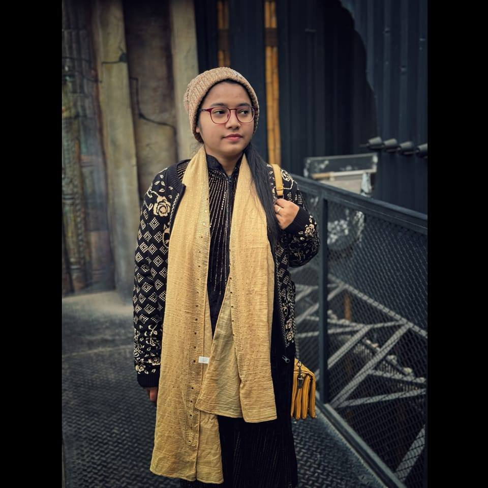
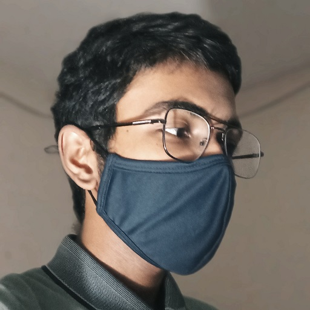
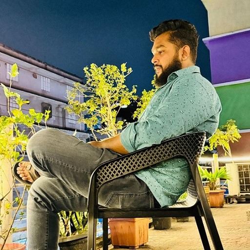

# CSE 102: The Exposition

On **February 14, 2024**, I made a commitment to give my best performance in the CSE subject. I am passionate about programming, and I have chosen to study Computer Science and Engineering by myself. But achieving success in any field requires **knowledge**, **effort** and **persistence**.

While I have some coding knowledge, I understand the importance of consistent practice to improve my programming skills. Even basic problem-solving can go a long way, enabling me to solve complex problems.

> This repository is an open book containing all my solutions to CSE problems. Most of these tasks were assigned by our CSE lecturer, [**Nafis Saami Azad (NSAZ)**][1]. I am extremely thankful to him for mentoring me and 41 other students during the first semester of **Intake 53**.

**Duration:** 3 months and 26 days (from **14 Feb 2024** to **9 Jun 2024**)

**Problems Solved:** 227

**Student Information:**

<table>
	<tr>
		<th align="left">Name</th>
		<td>Shadman&nbsp;Shahriar</td>
	</tr>
	<tr>
		<th align="left">Institution</th>
		<td><a href="https://www.bubt.edu.bd/"><b>Bangladesh&nbsp;University&nbsp;of&nbsp;Business&nbsp;and&nbsp;Technology&nbsp;(BUBT)</b></a>
		</td>
	</tr>
	<tr>
		<th align="left">Department</th>
		<td>Computer&nbsp;Science&nbsp;and&nbsp;Engineering&nbsp;(CSE)</td>
	</tr>
	<tr>
		<th align="left">ID&nbsp;No.</th>
		<td>20245103408</td>
	</tr>
	<tr>
		<th align="left">Intake</th>
		<td>53</td>
	</tr>
	<tr>
		<th align="left">Section</th>
		<td>11</td>
	</tr>
</table>
 

**Contributors:**

   
 

Special thanks to [**Tamanna**][2], [**Nasrin**][3], and [**Mubasshir**][4] for collecting various practice problems from other sections and contributing to this repository's growth.

[1]: https://www.linkedin.com/in/nafissaami/
[2]: https://www.facebook.com/tomaislam.tomaislam.7161
[3]: https://github.com/NasrinAkter19
[4]: https://www.facebook.com/stone.vieana
