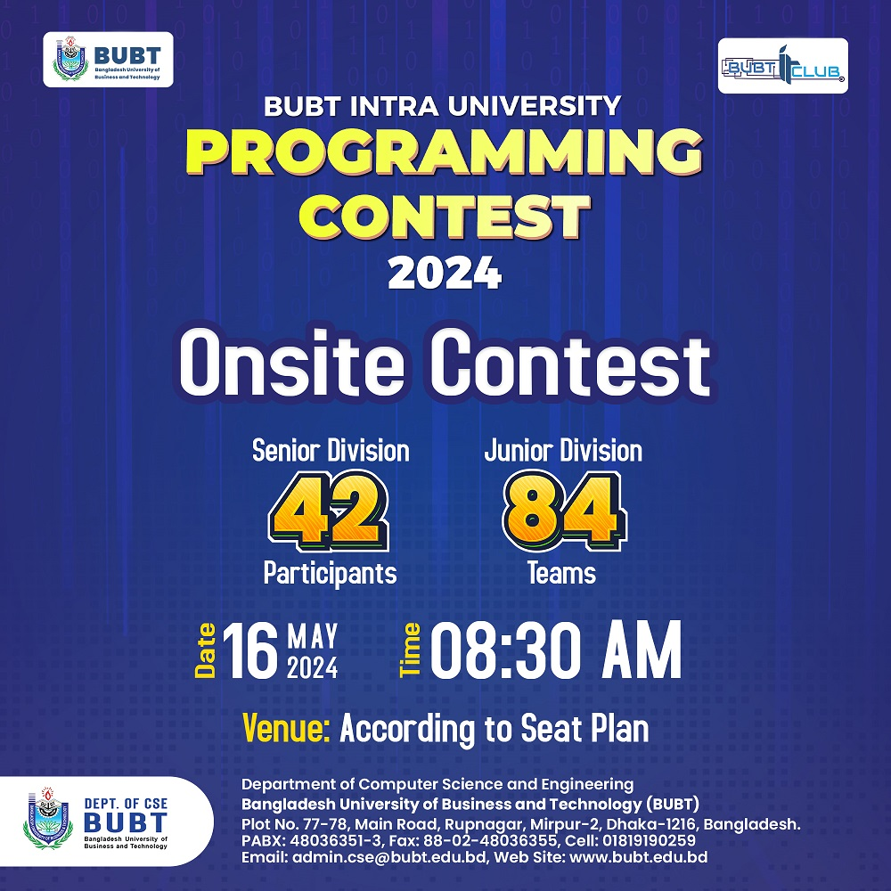
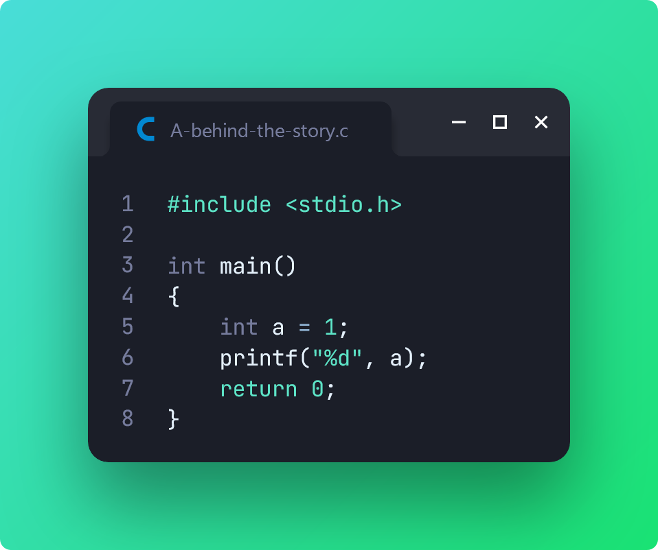
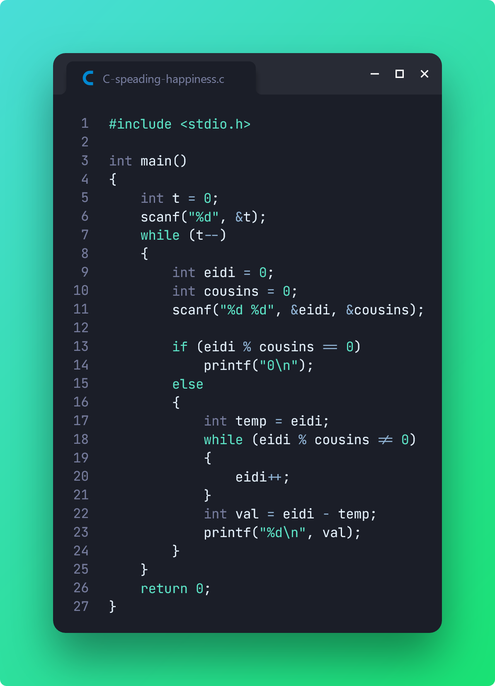
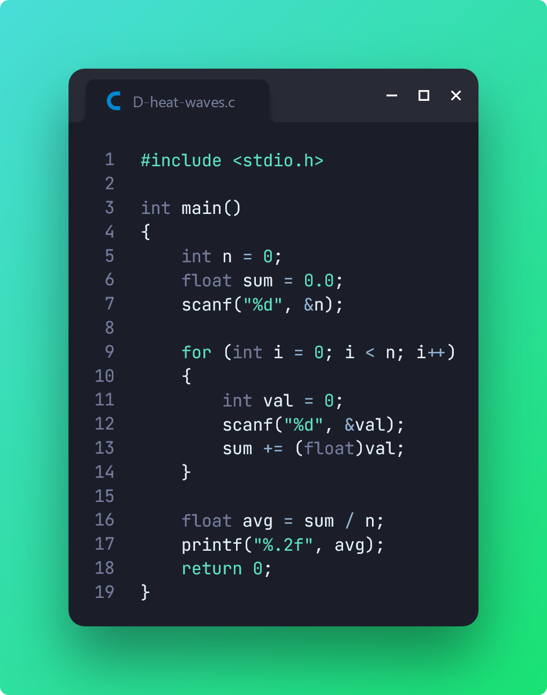
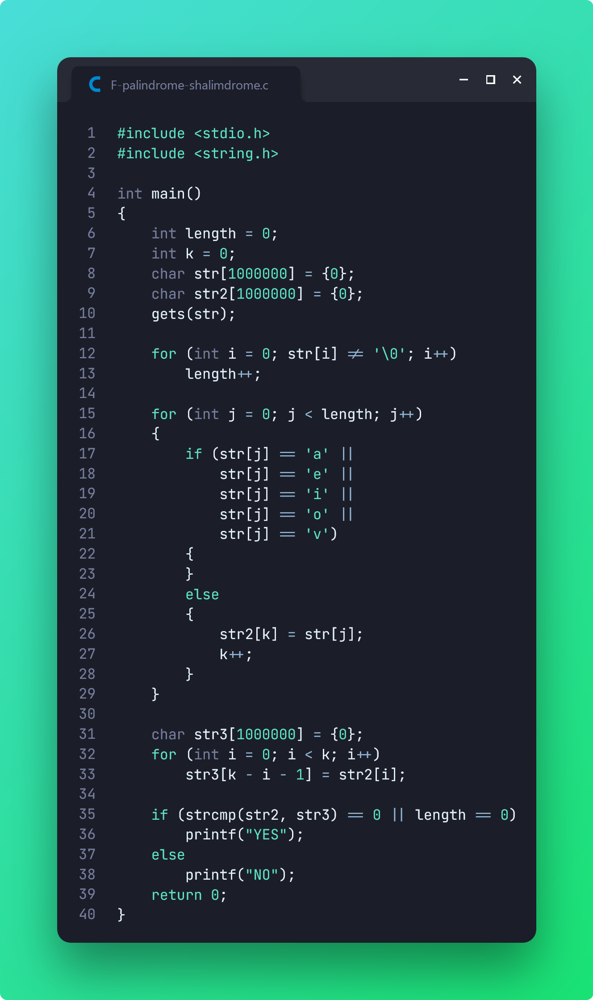

# BIUPC 2024 (Preliminary)

> [**BUBT IT Club**][1] organized an exciting Intra University Programming Contest, and as a student of **Intake 53**, I was thrilled to participate in the **Junior** division. Luckily enough, I was selected to attend the final onsite contest!

**Onsite Contest:** 16 May 2024 (from **08:30 AM** to **01:30 PM**)

[📌 **Problemset (Private)**][2]

[1]: https://www.facebook.com/BITCofficial
[2]: https://codeforces.com/gym/524390

I couldn't solve all 12 problems given in the problemset. Here are the ones I did end up solving:

## Problem A: Behind The Story

## Problem C: Spreading Happiness

## Problem D: Heat Waves

## Problem F: Palindrome Shalimdrome

