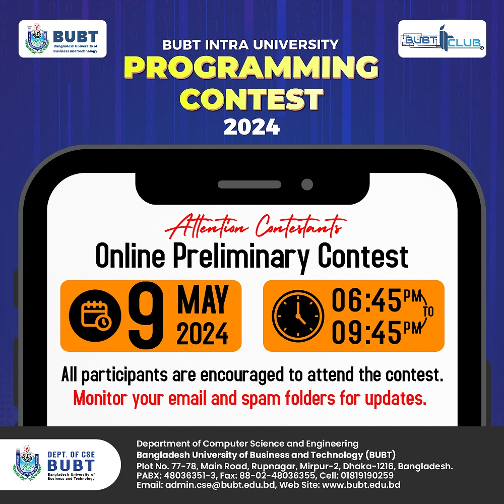
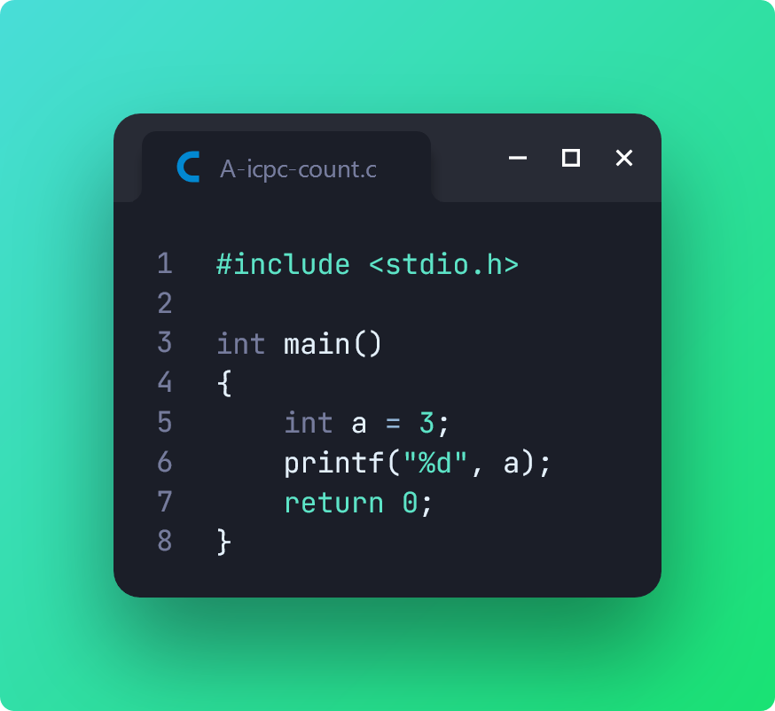
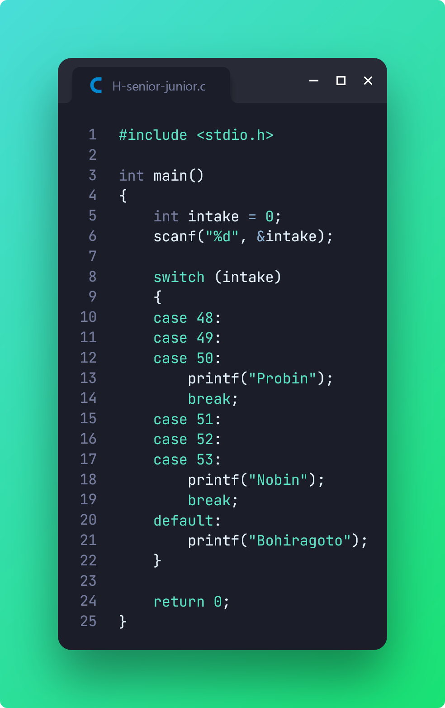
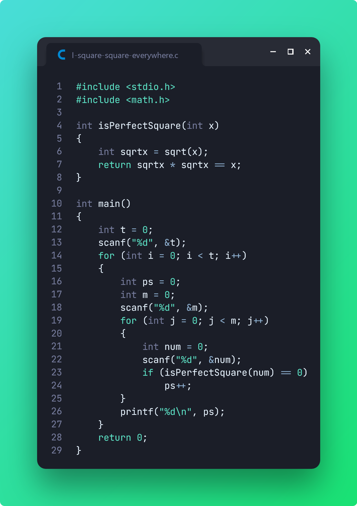

# BIUPC 2024 (Preliminary)

> [**BUBT IT Club**][1] organized an exciting Intra University Programming Contest, and as a student of **Intake 53**, I was thrilled to participate in the **Junior** division. Since it was my first time participating in a programming contest, I learned a lot about competitive programming. This definitely gave me a taste of real-world programming problems.

**Preliminary Contest:** 9 May 2024 (from **07:15 PM** to **10:15 PM**)

[📌 **Problemset (Private)**][2]

[1]: https://www.facebook.com/BITCofficial
[2]: https://codeforces.com/gym/523071

I couldn't solve all 10 problems given in the problemset. Here are the ones I did end up solving:

## Problem A: ICPC মানেই BUBT?

## Problem H: Senior Junior can't stay together

## Problem I: Square Square Everywhere

