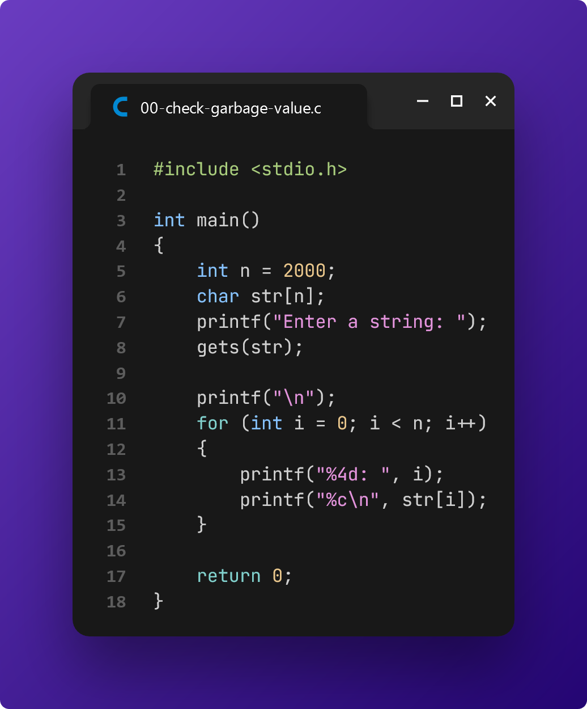

# Practice before Final Examination

> These were the lab tasks assigned by our CSE lecturer, **NSAZ** on **May 8, 2024**.

[📄 **Question Paper**](./tasks.pdf)

## Problem 1: String I/O

## Problem 2: Using ASCII values

## Problem 3: Using functions from the String library

## Task 1: A program that counts the total number of uppercase characters, lowercase characters, and special characters in a string

## Task 2: A program that takes a string as input from the user and checks whether it is a palindrome or not

Note: **You are not allowed to use any library function.**

## Bonus: Check the presence of garbage values in a long (mostly) empty character array

