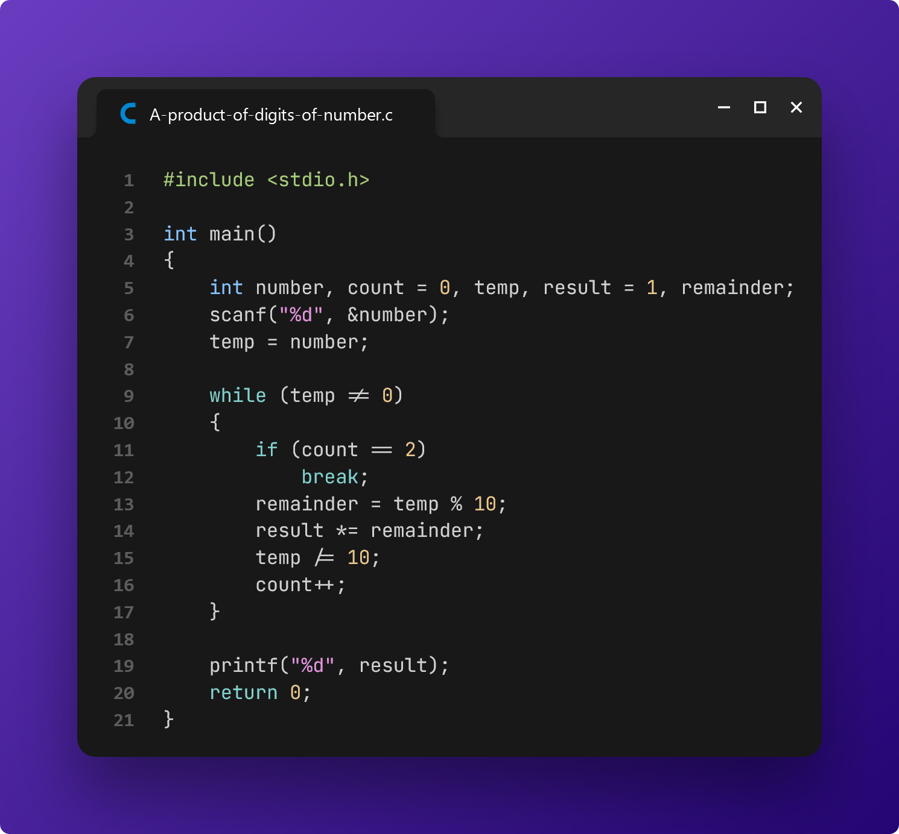
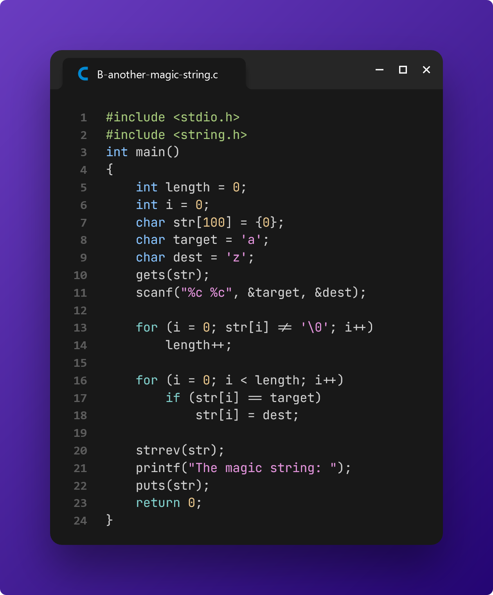
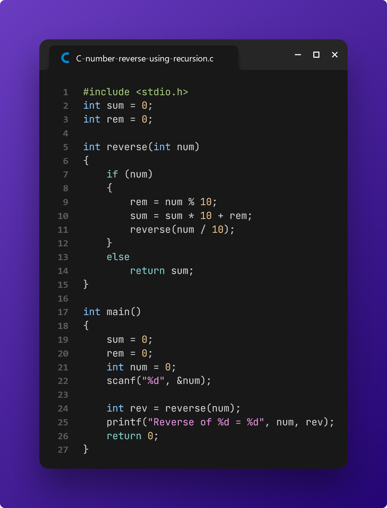
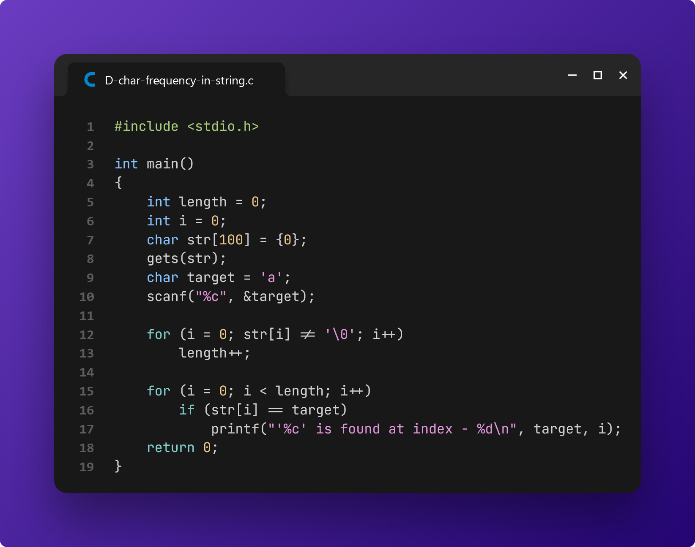
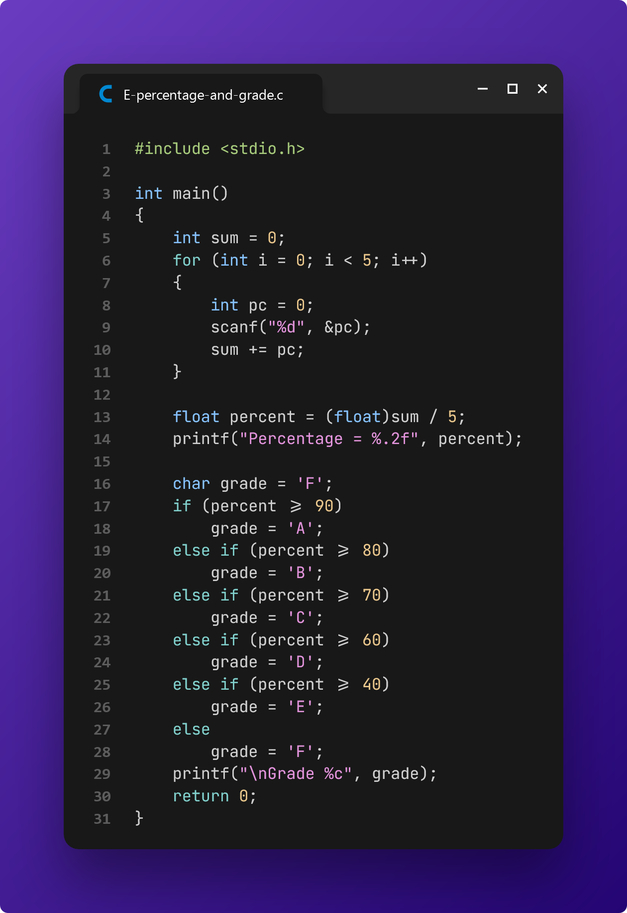
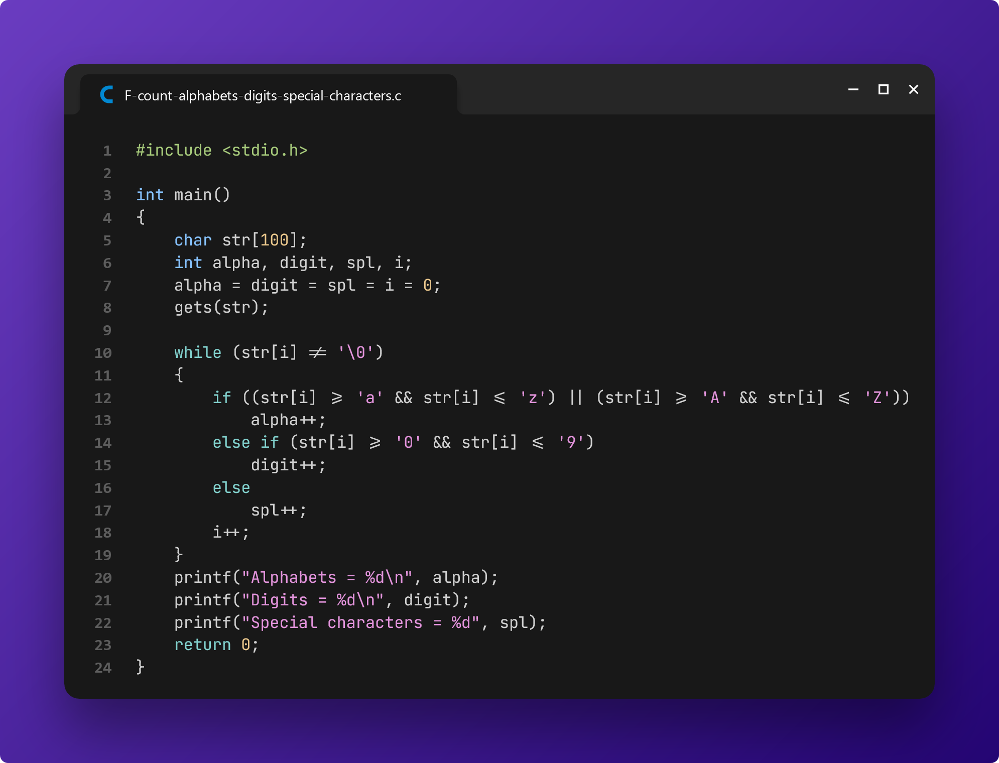
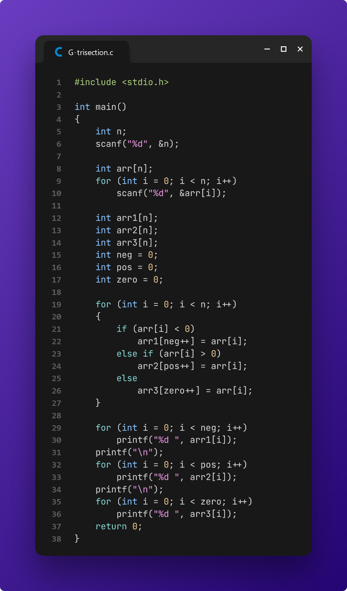

# Final Examination

> Our CSE lecturer, **NSAZ**, took an interesting approach to the final examination. To make the exam fun and challenging, he organized a contest on [**CodeForces**][1]. Since we are all fairly new to competitive programming, it was a memorable experience, and I learned a lot from it.

**Contest:** May 22, 2024 (from **02:00 PM** to **12:00 AM**)

[📌 **Problemset (Private)**][2]

[1]: https://codeforces.com/
[2]: https://codeforces.com/gym/525770

## Problem A: Find product of digits of a number

Write a C program to input a number from user and calculate product of its digits.

**Hints:**

-   How to find product of digits of a number using loop in C programming.
-   Logic to find product of last two digits of a given number in a C program.

**Input**

```c
1234
```

**Output**

```c
12
```

### My Submission



## Problem B: Another magic string

One day there was a magician, who every day shows new magic. One day he asks for help to show you a new magic. The magic was that you are given a _string_ and two _characters_, All the First character in the string is replaced by the Second character, After that, you get a _string_. Now you have to reverse the string and print the string. Suppose a string _S = abcaea_. You have given a character-_a_ in the second line and the third line contains a character _z_ and you have to replace all the characters in the string a by z. Now the string _S = zbczez_. After that, you have to print the string in reverse which is _zezcbz_.

### Input

The first line contains a _string_. The second line contains a _character_ which character you want to replace in the string and The third line contains a _character_ that you use to replace.

-   `1` ≤ String length ≤ `100`.
-   `'a'` ≤ First Character ≤ Second character ≤ `'z'`.

### Output

Print the magic string.

### Examples

**Input**

```
abacad
a z
```

**Output**

```
The magic string: dzczbz
```

**Input**

```
babdbbbaddda
b x
```

**Output**

```
The magic string: adddaxxxdxax
```

### My Submission



## Problem C: Find reverse of a number using recursion

Write a recursive function in C programming to find reverse of a number.

**Hints:**

-   How to find reverse of a number in C programming using recursion.
-   Logic to find reverse of a number using recursion in C programming.

### Input

Given only one integer `N`.

### Output

Print the number in reverse.

### Example

**Input**

```c
12345
```

**Output**

```c
Reverse of 12345 = 54321
```

### My Submission



## Problem D: C program to search all occurrences of a character in a string

Write a C program to search all occurrences of a character in a string using loop.

**Hints:**

-   How to find all occurrences of a character in a given string using for loop in C programming.
-   Program to print all index of a character in a given string.
-   Logic to search all occurrences of a character in given string in C program.

### Input

First line contains a string `S`.

Second line contains a character `C`.

### Output

Print all index of a character in the given string.

### Examples

**Input**

```
Hello, How are you?
e
```

**Output**

```c
'e' is found at index - 1
'e' is found at index - 13
```

**Input**

```
Nice to meet you buddy...
y
```

**Output**

```c
'y' is found at index - 13
'y' is found at index - 21
```

### My Submission



## Problem E: Find percentage and grade

Write a C program to input marks of five subjects Physics, Chemistry, Biology, Mathematics and Computer, calculate percentage and grade according to given conditions:

If percentage ≥ 90% : Grade A

If percentage ≥ 80% : Grade B

If percentage ≥ 70% : Grade C

If percentage ≥ 60% : Grade D

If percentage ≥ 40% : Grade E

If percentage < 40% : Grade F

### Input

Input contains _5_ integers.

### Output

See the example's output.

### Example

**Input**

```c
95
95
97
98
90
```

**Output**

```c
Percentage = 95.00
Grade A
```

### My Submission



## Problem F: Find total number of alphabets, digits or special characters

Write a C program to count total number of alphabets, digits or special characters in a string using loop.

**Hint:** How to find total number of alphabets, digits and special characters in a string in C programming.

### Input

Input contains only a string.

### Output

See the sample case.

### Examples

**Input**

```
H1 I am Belugaaa!!!
```

**Output**

```c
Alphabets = 12
Digits = 1
Special characters = 6
```

**Input**

```
I love BUBT CSE.
```

**Output**

```c
Alphabets = 12
Digits = 0
Special characters = 4
```

### My Submission



## Problem G: Trisection

Given an array of n integers, you have to split it into three non-empty sets in a way that the first set contains only negative integers, the second set contains only positive integers, the third set contains only zero.

Can you help Moon to write a program to divide the array satisfying these conditions?

### Input

First line contains an integer n (3 ≤ n ≤ 99), the size of the array.

Second line contains the elements of the array.

### Output

Print the three non-empty arrays.

### Examples

**Input**

```c
6
8 9 10 -4 -10 0
```

**Output**

```c
-4 -10
8 9 10
0
```

### My Submission


