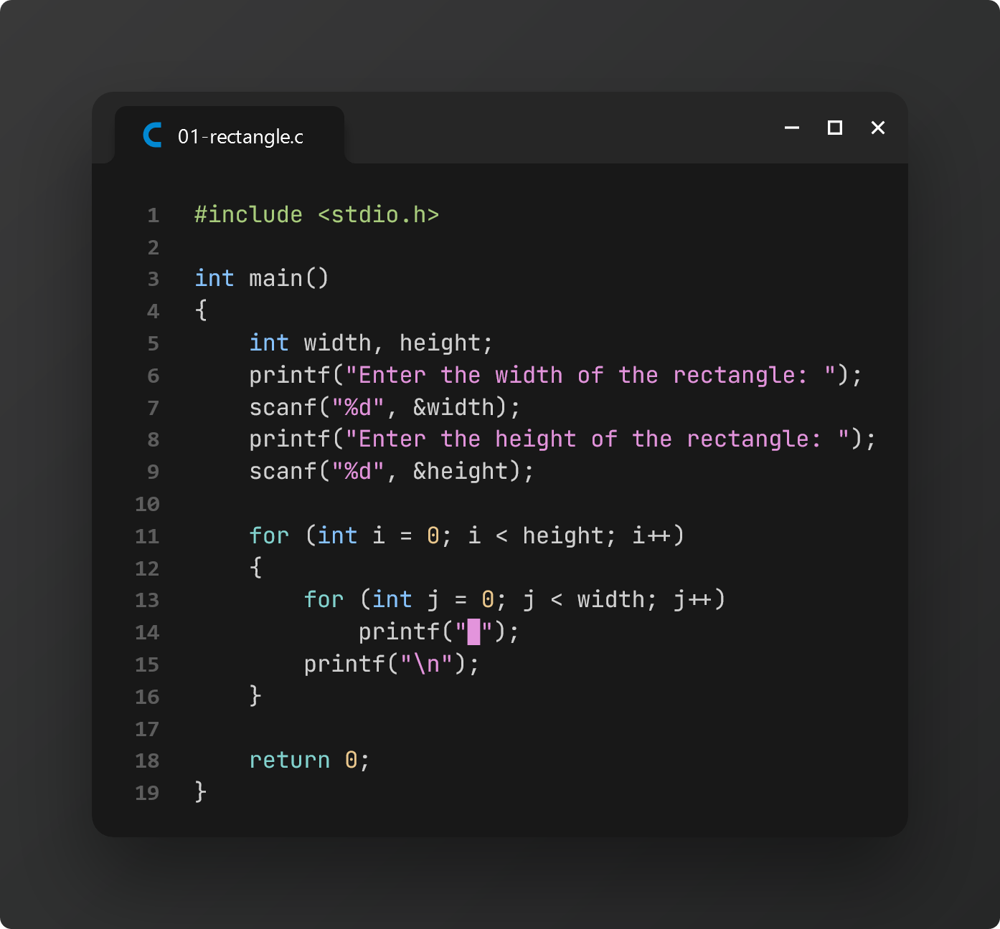
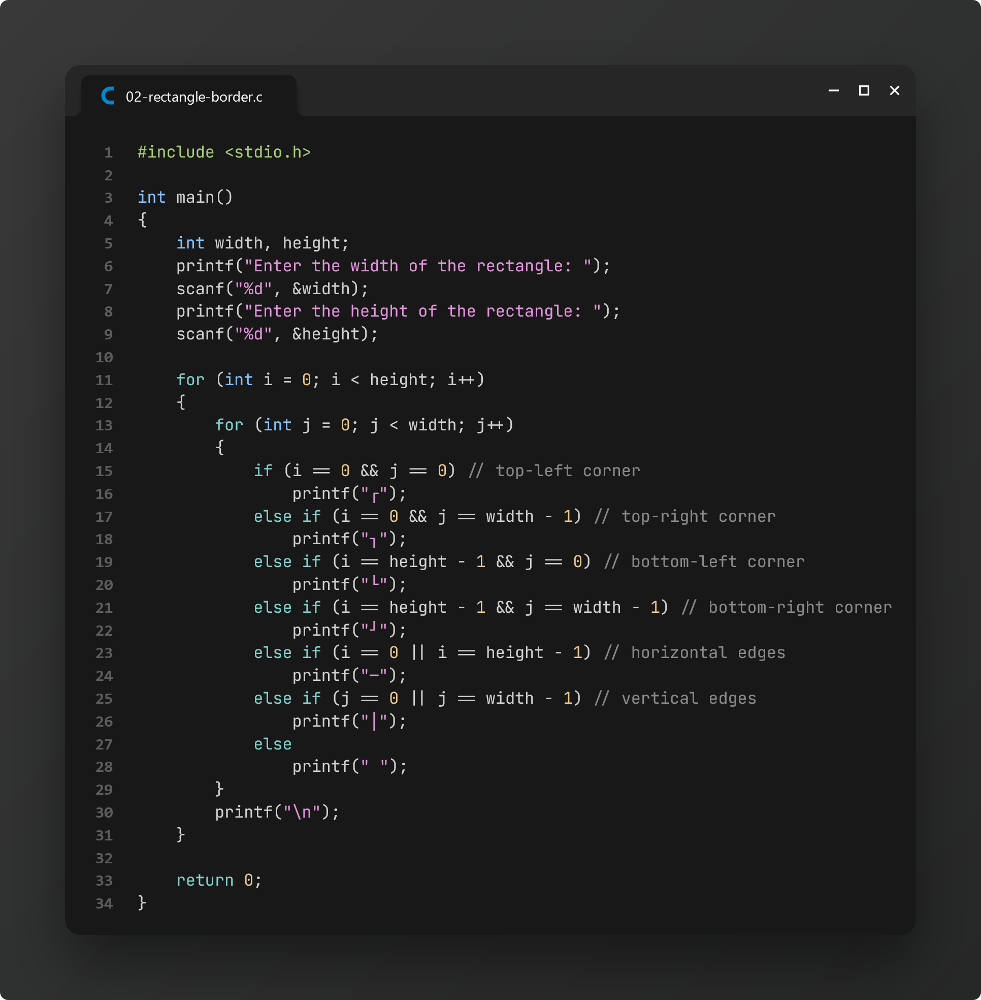
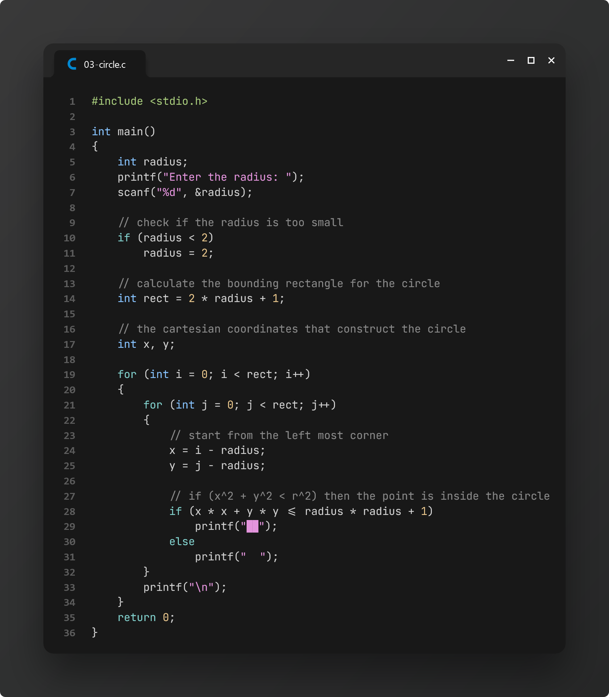
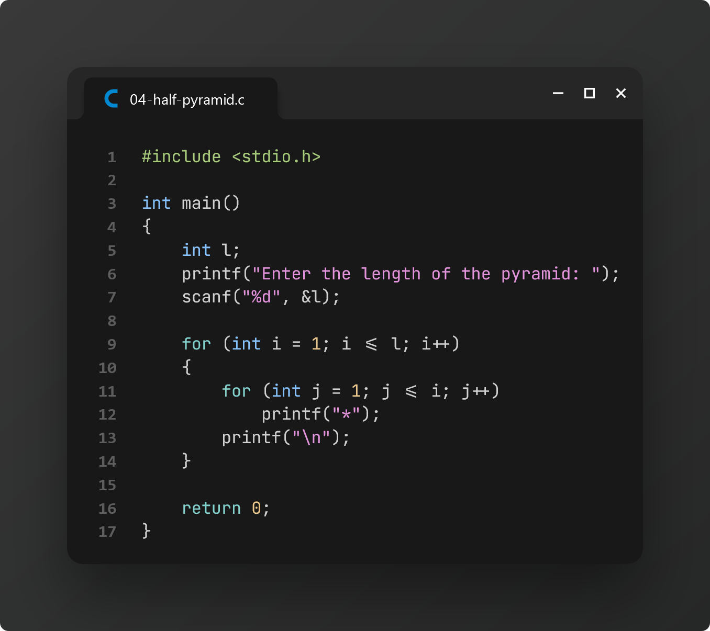
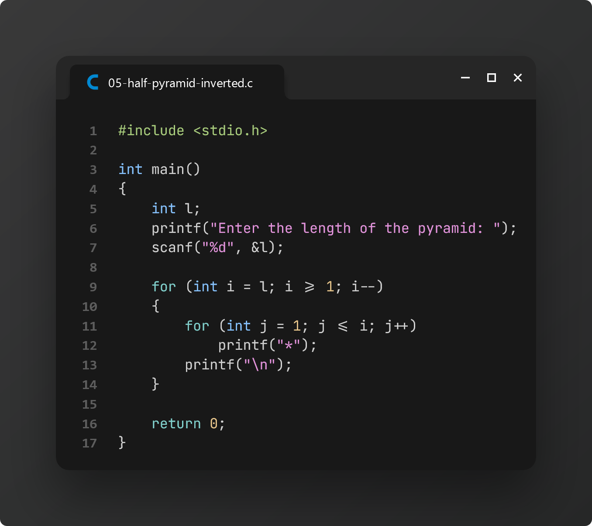
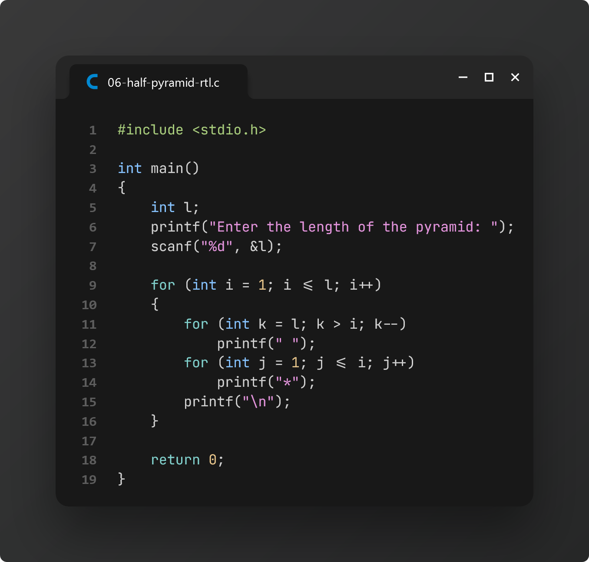
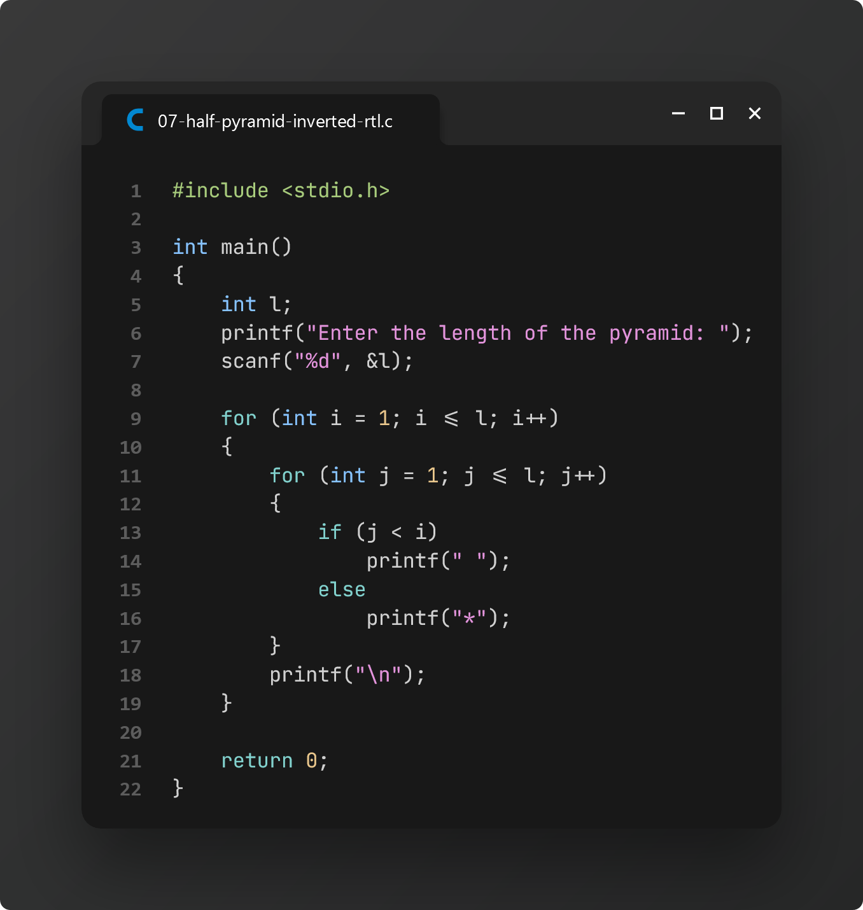

# Practice 0: ASCII Art

> Art always kindles joy in my heart. Since I have some coding knowledge, I have completed these fun exercises to apply fundamental programming concepts in the C language.

### Task 1: Showing a Rectangle in the Terminal

### Task 2: Showing a Rectangular border in the Terminal

### Task 3: Creating a Circle in the Terminal with Unicode Characters

### Task 4: Creating a Half-Pyramid of Asterisks

### Task 5: Creating an Inverted Half-Pyramid of Asterisks

### Task 6: Creating a Reversed Half-Pyramid of Asterisks

### Task 7: Creating a Reversed Inverted Half-Pyramid of Asterisks

