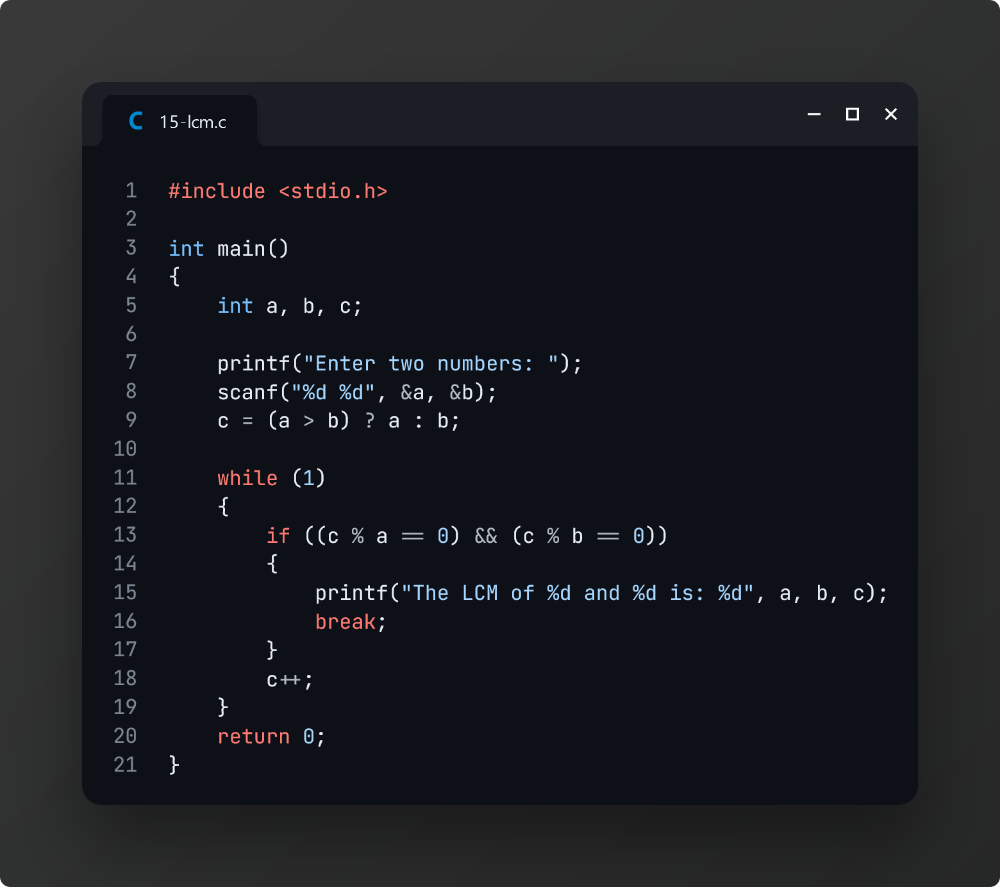
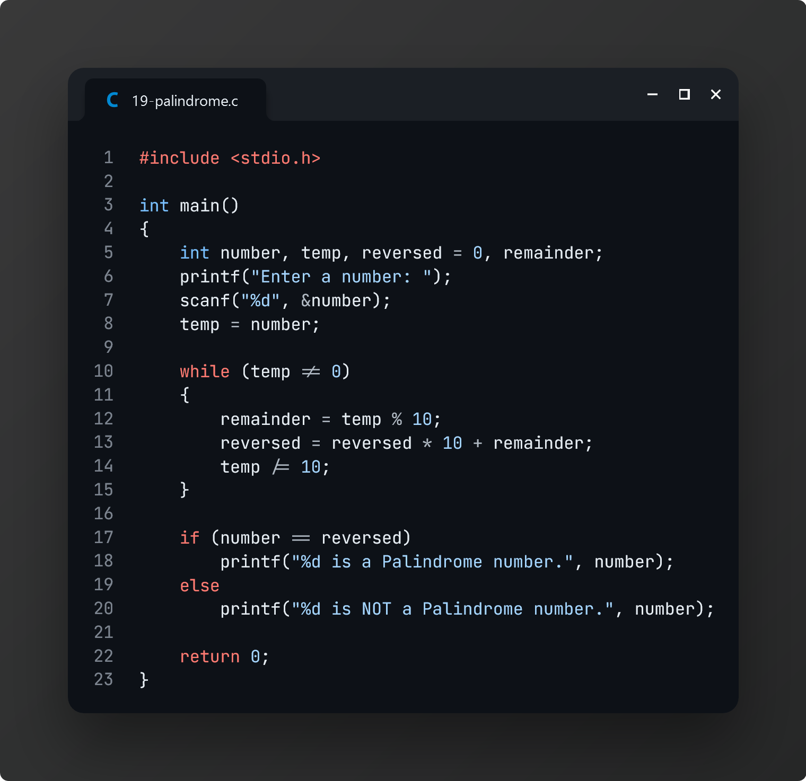

# Practice 1: C Programming Basics

> These practice problems were given as homework by our CSE lecturer, **NSAZ** on **February 11, 2024**.

[📌 **Question Paper**](./tasks.pdf)

### Task 1: Print "Hello World"

### Task 2: Take the value of a variable as input and print the variable

### Task 3: Take multiple inputs from the user on the same line and print them in order

### Task 4: Take four numbers as input from the user and print their average

### Task 5: Take the height and width as input from the user and find the area of a triangle

### Task 6: Write a program that takes nine numbers as input from the user and prints them in a 3×3 matrix structure

### Task 7: Take the radius as input from the user and find the area of a circle

### Task 8: Take two numbers as input from the user and print all the odd numbers between those two numbers, including those two numbers

### Task 9: Take the pH as input from the user and print whether the liquid is acidic or basic

### Task 10: Take a number as input from the user and print whether it is a prime number or not

### Task 11: Take the Celcius as input from the user and print the corresponding Fahrenheit

### Task 12: Take the year as input from the user and print whether it is a leap year or not

### Task 13: Take two numbers as input from the user and swap their values

### Task 14: Take the number as input from the user and reverse the digits of the number (i.e. 7842 will be 2487)

### Task 15: Take two numbers as input and find their LCM

### Task 16: Take two numbers as input and find their HCF

### Task 17: Take a number as input and find the factorial of that number. (i.e. 4! = 24)

### Task 18: Take an integer nas input from the user. Write a program that displays the Fibonacci series up to n term

### Task 19: Take a number as input and check whether it is a palindrome or not

### Task 20: Take an input nfrom the user. Then take nnumbers as input from the user and print the average of those numbers

### Task 21: Write a program to swap two numbers without using a third variable

### Task 22: Take a number as input and swap the first and last digits of that number (i.e. 7842 will be 2847)

