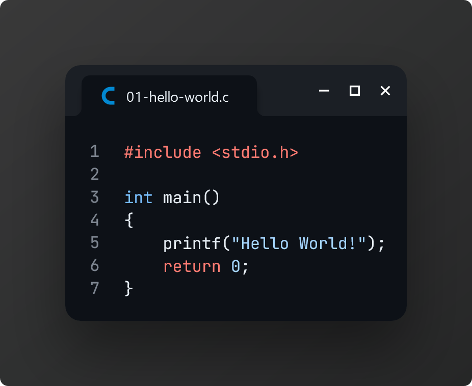
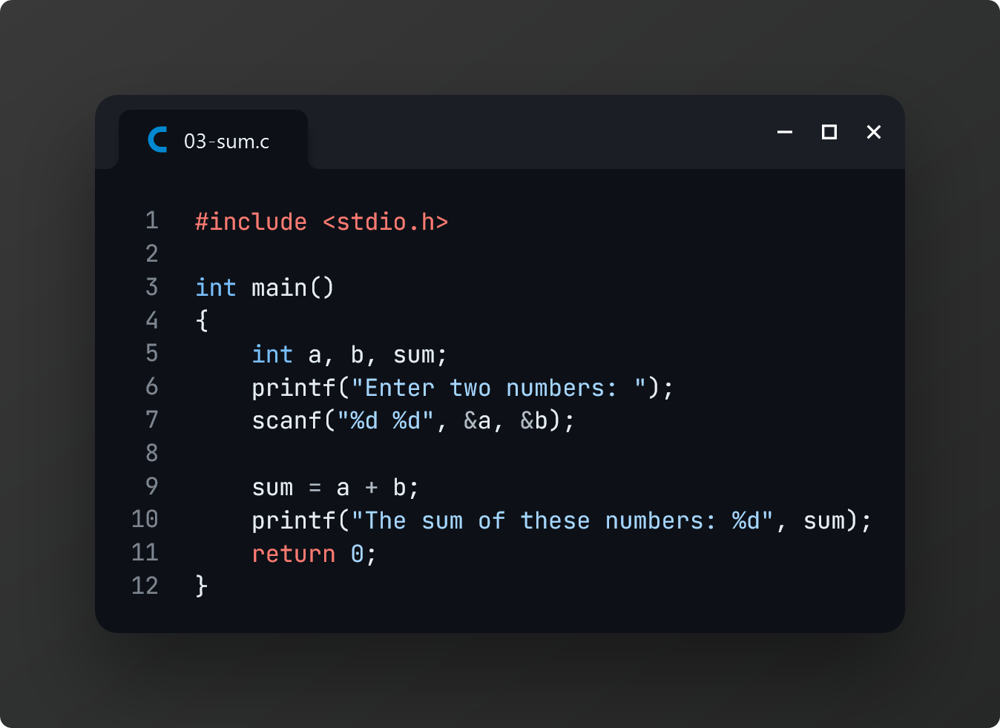

# Practice 2: Mid-Term Examination

> On **February 27, 2024**, our class representative, [**Toma Islam (ID 406)**][1], collected these practice problems from another section to help us prepare for our CSE examination.

[📌 **Question Paper**](./tasks.pdf)

### Task 1: Say hello with C

### Task 2: Basic input/output (int, float, char)

### Task 3: Sum two numbers taking user input

### Task 4: Multiply two numbers taking user input

### Task 5: Find the quotient of two numbers taking user input

### Task 6: Build simple calculator

### Task 7: Find the area of a circle

### Task 8: Find the area of a triangle

### Task 9: Check negative, positive or zero

### Task 10: Find maximum of two numbers

### Task 11: Check even or odd

### Task 12: Check uppercase or lowercase

### Task 13: Check vowel or consonant

### Task 14: Check leap year

### Task 15: Check divisibility

### Task 16: Find maximum of three numbers

### Task 17: Check alphabet, digit or special character

### Task 18: Accept two integers and check whether they are equal or not

### Task 19: Read the age of a candidate and determine whether he is eligible to cast his vote

### Task 20: BUBT grading system

### Task 21: Print natural numbers from 1 to n

### Task 22: Print natural numbers from m to n

### Task 23: Print alphabets from a to z

### Task 24: Print even numbers from 1 to n

### Task 25: Print even numbers from m to n

### Task 26: Print odd numbers from 1 to n

### Task 27: Print odd numbers from m to n

### Task 28: Print sum of all numbers from 1 to n

### Task 29: Print sum of all numbers from m to n

### Task 30: Print sum of all odd numbers from 1 to n

### Task 31: Print sum of all odd numbers from m to n

### Task 32: Print sum of all even numbers from 1 to n

### Task 33: Print sum of all even numbers from m to n

### Task 34: Print multiplication table of n

### Task 35: Find number of digits in a number

### Task 36: Find first and last digit

### Task 37: Find sum of first and last digit

### Task 38: Find sum of digits of a number

### Task 39: Find reverse of a number

### Task 40: Find power of a number using loop

### Task 41: Find factorial of a number

[1]: https://www.facebook.com/tomaislam.tomaislam.7161
