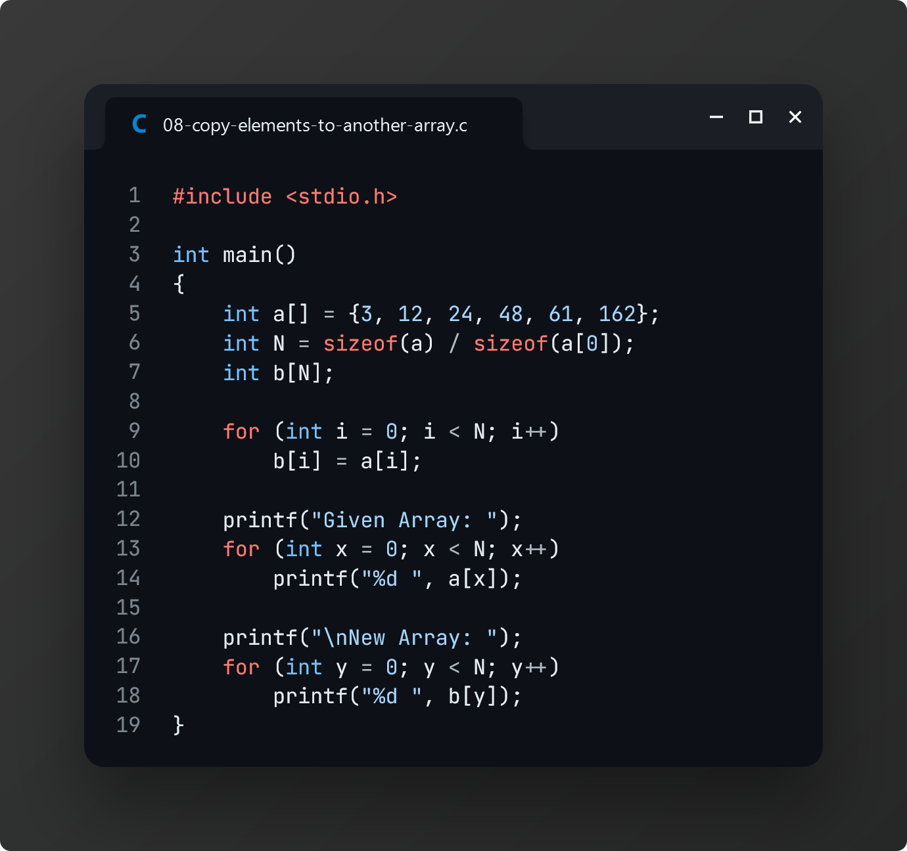

# Practice 3: Array Basics

> These practice problems are based on the study material provided by our CSE lecturer, **NSAZ** on **March 28, 2024**.

[📌 **Lecture Slide: Array in Structured Programming**](./lecture.pptx)

## Task 1: Find minimum and maximum value in an Array

## Task 2: Find a value in an Array

## Task 3: Delete a value from an Array

## Task 4: Calculate the sum of all values in an Array

## Task 5: Count the total number of duplicate elements in an Array

## Task 6: Count the total number of distinct elements in an Array

## Task 7: Print a string using an Array

## Task 8: Copy elements from one Array to another

## Task 9: Calculate average of all values in an Array

## Task 12: Print elements in a Martix

## Task 13: Sort an array using Selection Sort

> Our class representative, **Mubasshir Siam (ID 409)**, sent me two additional exercises on **April 23, 2024**.

[📌 **Question Paper**](./tasks.jpg)

## Task 10: Find the transpose of a given Matrix (2D Array)

## Task 11: Find the sum of individual columns of a 2D Array

