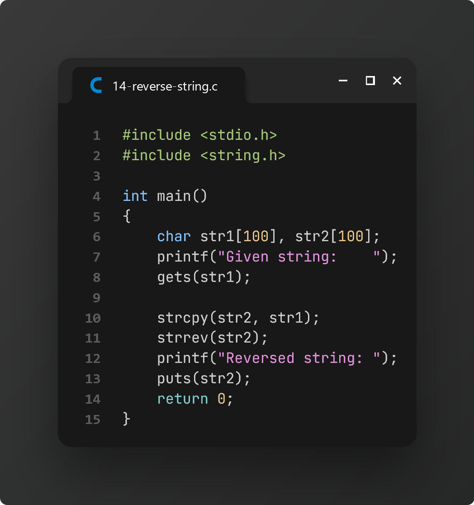
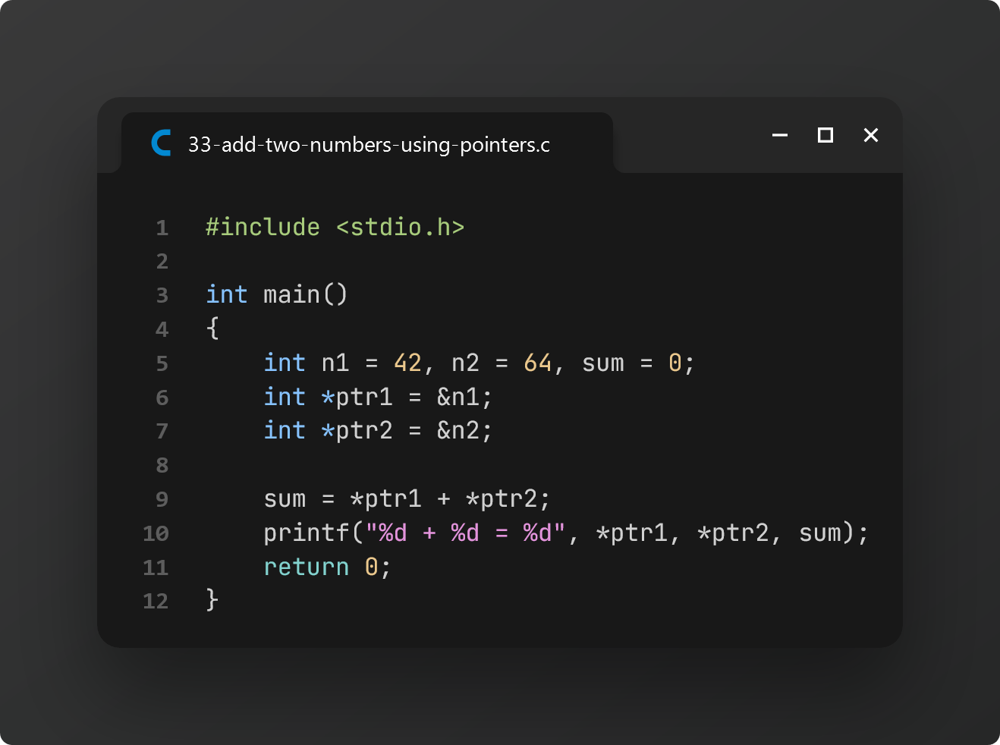

# Practice 4: Final Examination

> On **May 10, 2024**, [**Nasrin Akter (ID 407)**][1] collected these practice problems from another section to help us prepare for our CSE examination.

[📌 **Question Paper**](./tasks.pdf)

## Task 1: C program to find square of a number using function (apply 4 types)

## Task 2: C program to find cube of a number using function

## Task 3: C program to find diameter, circumference and area of a circle using function

## Task 4: C program to find factorial of a number using recursion

## Task 5: C program to print all natural numbers from 1 to n using recursion

## Task 6: C program to find power of a number using recursion

## Task 7: C program to declare, initialize, input and print array elements

## Task 8: C program to read n number of values in an array and display them in reverse order

## Task 9: Take an integer array where the user will give size and find the sum of the numbers in the array

## Task 10: Until the user quits, take input from the user and find whether it is zero, positive, or negative using a while loop

## Task 11: Take a character array of size 20 (user input) and convert all letters to the uppercase letter

## Task 12: C program to find the second largest number

## Task 13: C program to concatenate two strings

## Task 14: C program to reverse a string

## Task 15: C program to merge two strings

## Task 16: C program to convert lowercase string to uppercase

## Task 17: C program to remove all spaces from a string

## Task 18: C program that will copy elements of an array into another array

## Task 19: C program that will count the sum of all elements of a 2D Array

## Task 20: C program to check whether a string is palindrome or not

## Task 21: C program that will count the total number of alphabets and the total number of digits in a string

## Task 22: Input and display character elements

## Task 23: Sum of all array elements

## Task 24: Insert new element in an array

## Task 25: Search an element in array/linear search

## Task 26: Find frequency of array elements

## Task 27: Add two matrices

## Task 28: Check if two matrices are equal

## Task 29: Find length of a given string

## Task 30: Compare two strings

## Task 31: Merge two array to third array

## Task 32: Create, initialize and use pointer

## Task 33: Add two numbers using pointers

## Task 34: Swap two numbers using pointers

## Task 35: Access array using pointers

## Task 36: Create file and write contents

## Task 37: Read file contents and display into the terminal

## Task 38: Append contents to file

[1]: https://www.facebook.com/profile.php?id=100083296789987
