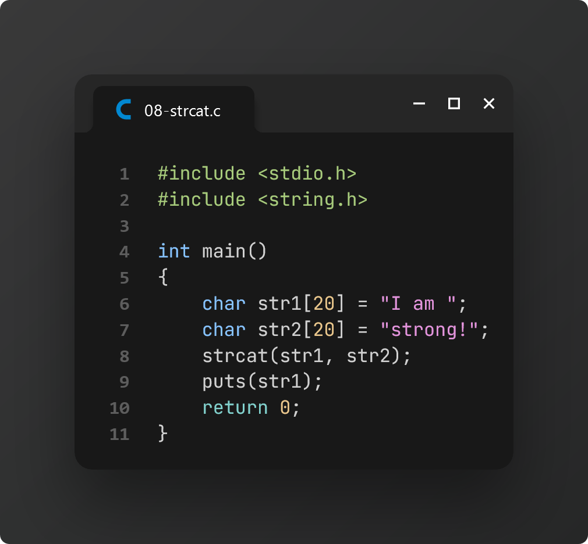

# Practice 5: Final Examination (Pointers & Strings)

> The following practice problems are based on the study material provided by our CSE lecturer, **NSAZ** on **May 8, 2024**.

[📌 **Lecture Slide: Strings**][1]

### Task 1: Hello World

### Task 2: String Initialization

### Task 3: Input a word

### Task 4: Input a string

### Task 5: Input a string with `fgets`

### Task 6: Library function: `strlen`

### Task 7: Library function: `strcpy`

### Task 8: Library function: `strcat`

### Task 9: Library function: `strcmp`

### Task 10: Library function: `strupr`

### Task 11: Library function: `strlwr`

### Task 12: Library function: `strstr`

> The following practice problems are based on the study material provided by our CSE lecturer, **NSAZ** on **May 9, 2024**.

[📌 **Lecture Slide: Pointers**][0]

[📌 **Pointers Playlist (by Anisul Islam)**][2]

### Task 13: Pointers

### Task 14: Pointer to Pointer

### Task 15: Pointer Format Specifier

### Task 16: NULL Pointer

### Task 17: Pointers and Arrays

### Task 18: Swap values using Pointers

<!-- === links === -->

[0]: ./lecture-pointers.pptx
[1]: ./lecture-strings.pptx
[2]: https://www.youtube.com/watch?v=zl9hmnj7BZU&list=PLm6UpFb35TJ54xr6bjrtS9PTFnCz340TF
