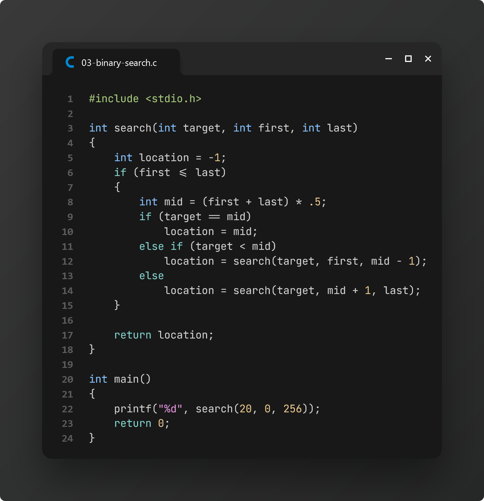

# Practice 6: Final Examination (Recursion & File Handling)

> The following practice problems are based on the study material provided by our CSE lecturer, **NSAZ** on **May 29, 2024**.

[📌 **Lecture Slide: Recursion**][0]

[📌 **Lecture Slide: File Handling**][1]

[📌 **File Handling Playlist (by Anisul Islam)**][2]

### Task 1: Factorial using Recursion

### Task 2: Fibonacci Series using Recursion

### Task 3: Binary Search

### Task 4: Library function: `fopen`

### Task 5: Library function: `fputs`

### Task 6: Struct

<!-- === links === -->

[0]: ./lecture-recursion.pptx
[1]: ./lecture-file-handling.pptx
[2]: https://www.youtube.com/watch?v=pB45aYxFYd0&list=PLUsisfTQpWVa1nzx_b1fur3ss_HKOq8dq
