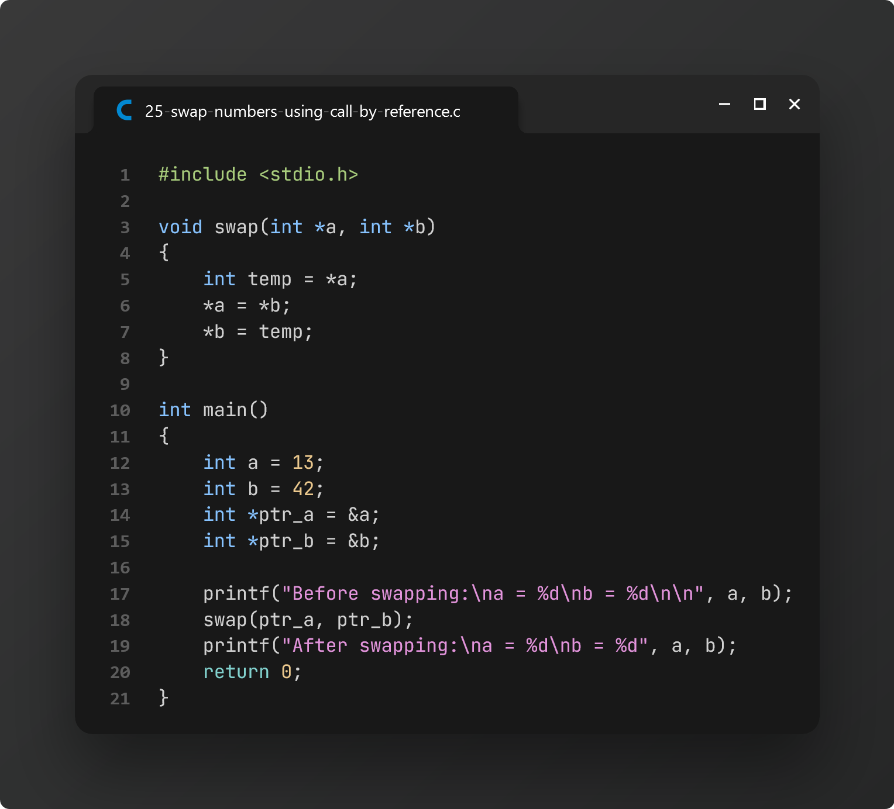

# Practice 7: Final Examination (Last Minute Preparation)

> On **May 31, 2024**, [**Nasrin Akter (ID 407)**][1] messaged me saying the following topics are marked as important in other sections:

1. **2D Array** (Matrix I/O, Matrix Sum and Comparison)
2. **File Handling** (Read/Write, Append)
3. **Basic Recursion**
4. **String** (Lab Tasks)

So, here is a compilation of practice problem focused on these 4 topics:

### Task 1: Recursive Factorial

### Task 2: Recursive Exponential

### Task 3: Sum of all elements of a 2D Array

### Task 4: Add two matrices

### Task 5: Check if two matrices are equal

### Task 6: Check whether a string is palindrome or not

### Task 7: Access array using pointers

### Task 8: Create file and write contents

### Task 9: Read file contents and display into the terminal

### Task 10: Append contents to file

> On the same day, our class representative, [**Toma Islam (ID 406)**][0], collected these practice problems from another section:

### Task 11: Add two numbers using recursion

### Task 12: Reverse a number using recursion

### Task 13: Find the maximum and minimum range of elements in an Array

### Task 14: Find Factorial of a number using recursion

Duplicate of [**Task 1**](#task-1-recursive-factorial)

### Task 15: Generate the `n`th Fibonacci term using recursion

### Task 16: Compare two Strings without Library functions

### Task 17: Find the second largest element in an Array

### Task 18: Count the total number of even and odd elements in an Array

### Task 19: Add two 2x2 matrices

Similar to [**Task 4**](#task-4-add-two-matrices)

### Task 20: Copy one String to another

### Task 21: Concatenate and Compare two Strings

### Task 22: Count the total number of alphabets, digits, and special characters in a String

### Task 23: Count the total number of words in a string

### Task 24: Check if a String is palindrome or not

### Task 25: Swap two numbers using call by reference (Pointers)

[0]: https://www.facebook.com/tomaislam.tomaislam.7161
[1]: https://www.facebook.com/profile.php?id=100083296789987
